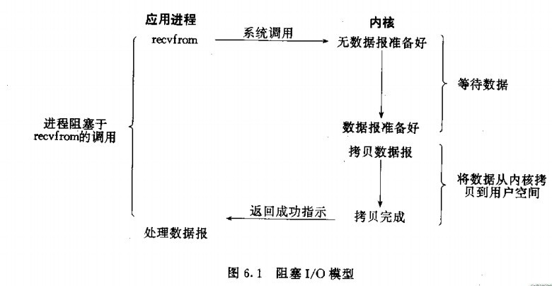
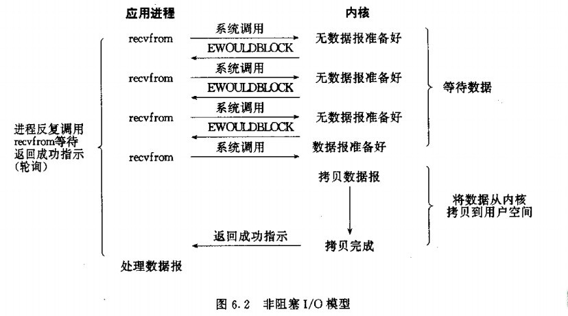
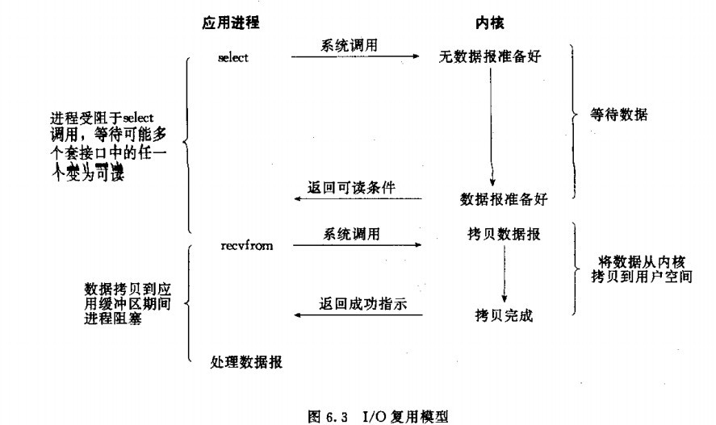
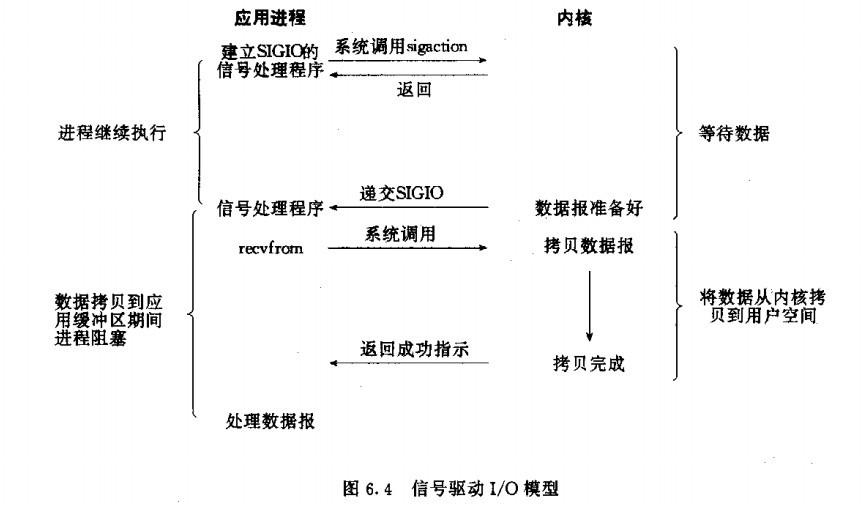
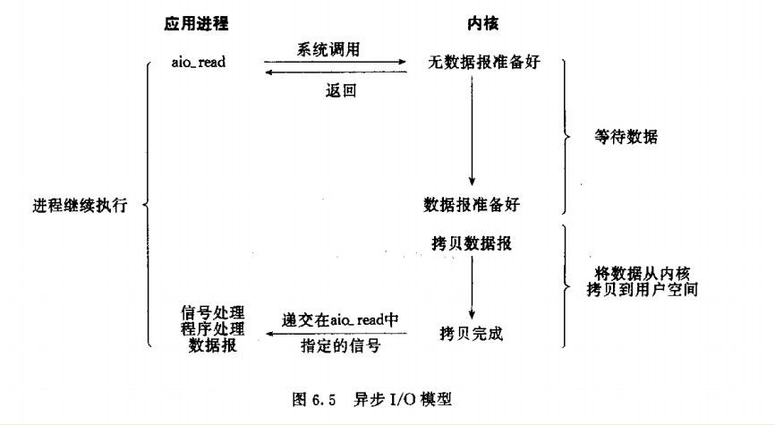

常见网络IO模型
===
## 同步异步
* 同步：
    * 所谓同步，就是在发出一个功能调用时，在没有得到结果之前，该调用就不返回。也就是必须一件一件事做,等前一件做完了才能做下一件事。
    * 例如普通B/S模式（同步）：提交请求->等待服务器处理->处理完毕返回 这个期间客户端浏览器不能干任何事
* 异步：
    * 异步的概念和同步相对。当一个异步过程调用发出后，调用者不能立刻得到结果。实际处理这个调用的部件在完成后，通过状态、通知和回调来通知调用者。
    * 例如 ajax请求（异步）: 请求通过事件触发->服务器处理（这是浏览器仍然可以作其他事情）->处理完毕
## 阻塞非阻塞
* 阻塞：
    * 阻塞调用是指调用结果返回之前，当前线程会被挂起（线程进入非可执行状态，在这个状态下，cpu不会给线程分配时间片，即线程暂停运行）。函数只有在得到结果之后才会返回。
    * 有人也许会把阻塞调用和同步调用等同起来，实际上他是不同的。对于同步调用来说，很多时候当前线程还是激活的，只是从逻辑上当前函数没有返回,它还会抢占cpu去执行其他逻辑，也会主动检测io是否准备好。
* 非阻塞
    * 非阻塞和阻塞的概念相对应，指在不能立刻得到结果之前，该函数不会阻塞当前线程，而会立刻返回。
## 再简单点理解就是：
1. 同步，就是我调用一个功能，该功能没有结束前，我死等结果。
2. 异步，就是我调用一个功能，不需要知道该功能结果，该功能有结果后通知我（回调通知）
3. 阻塞，就是调用我（函数），我（函数）没有接收完数据或者没有得到结果之前，我不会返回。
4. 非阻塞，就是调用我（函数），我（函数）立即返回，通过select通知调用者
* 同步IO和异步IO的区别就在于：数据拷贝的时候进程是否阻塞
* 阻塞IO和非阻塞IO的区别就在于：应用程序的调用是否立即返回

## 五种IO模型
1. 阻塞I/O（blocking I/O）
2. 非阻塞I/O （nonblocking I/O）
3. I/O复用(select 和poll) （I/O multiplexing）
4. 信号驱动I/O （signal driven I/O (SIGIO)）
5. 异步I/O （asynchronous I/O (the POSIX aio_functions)）

### 阻塞I/O
* 应用程序调用一个IO函数，导致应用程序阻塞，等待数据准备好。 如果数据没有准备好，一直等待….数据准备好了，从内核拷贝到用户空间,IO函数返回成功指示。
* 当调用recv()函数时，系统首先查是否有准备好的数据。如果数据没有准备好，那么系统就处于等待状态。当数据准备好后，将数据从系统缓冲区复制到用户空间，然后该函数返回。在套接应用程序中，当调用recv()函数时，未必用户空间就已经存在数据，那么此时recv()函数就会处于等待状态。
* 阻塞I/O模型图：在调用recv()/recvfrom（）函数时，发生在内核中等待数据和复制数据的过程。

### 非阻塞I/O
* 非阻塞IO通过进程反复调用IO函数（多次系统调用，并马上返回）；在数据拷贝的过程中，进程是阻塞的
* 我们把一个SOCKET接口设置为非阻塞就是告诉内核，当所请求的I/O操作无法完成时，不要将进程睡眠，而是返回一个错误。这样我们的I/O操作函数将不断的测试数据是否已经准备好，如果没有准备好，继续测试，直到数据准备好为止。在这个不断测试的过程中，会大量的占用CPU的时间。

### IO复用
* 主要是select和epoll；对一个IO端口，两次调用，两次返回，比阻塞IO并没有什么优越性；关键是能实现同时对多个IO端口进行监听； I/O复用模型会用到select、poll、epoll函数，这几个函数也会使进程阻塞，但是和阻塞I/O所不同的的，这两个函数可以同时阻塞多个I/O操作。而且可以同时对多个读操作，多个写操作的I/O函数进行检测，直到有数据可读或可写时，才真正调用I/O操作函数。

### 信号驱动IO
* 首先我们允许套接口进行信号驱动I/O,并安装一个信号处理函数，进程继续运行并不阻塞。当数据准备好时，进程会收到一个SIGIO信号，可以在信号处理函数中调用I/O操作函数处理数据。

### 异步IO
* 当一个异步过程调用发出后，调用者不能立刻得到结果。实际处理这个调用的部件在完成后，通过状态、通知和回调来通知调用者的输入输出操作

### 总结

